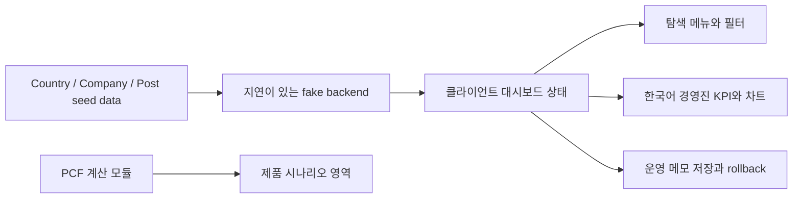

# 하나루프 탄소 대시보드

하나루프 프론트엔드 채용 과제를 위한 회사형 탄소 배출량 대시보드입니다.
프로젝트 안내문에서 제시한 `Company`, `GhgEmission`, `Post` 데이터 모델을 기준으로 회사별 배출량, 국가별 탄소세 노출, 월별 추이, 운영 메모를 한 화면에서 확인할 수 있습니다.

## 로컬 실행

1. 의존성을 설치합니다.

```bash
npm install
```

2. 개발 서버를 실행합니다.

```bash
npm run dev
```

3. 브라우저에서 `http://localhost:3000`을 엽니다.

## 검증 명령

```bash
npm run lint
npm run test
npm run build
```

현재 기준 세 명령 모두 통과합니다.

## 구현 범위

- 대상: 회사/계열사 배출량 포트폴리오
- 기술 스택: TypeScript, Next.js App Router, React, CSS
- 핵심 화면: navigation drawer, 경영진 KPI, 회사별 배출량, 국가별 탄소세 노출, 월별 배출량 추이, 회사별 운영 메모, PCF 시나리오
- 입력 UX: 회사별 Post 작성, fake backend 저장 실패 시 optimistic rollback, 생산수량/활동량 조정 시나리오
- 내부 API: `/api/pcf/summary`
- fake backend: `src/lib/api.ts`에서 200-800ms 지연과 15% write 실패를 시뮬레이션
- 테스트: 회사 배출량 요약 테스트, PCF 계산 테스트, 입력 검증 테스트, API 응답 테스트, 앱 진입점 smoke 테스트

## 주요 결과

| 항목 | 값 |
| --- | --- |
| 총 배출량 | `2,599 tCO2e` |
| 최신 월 배출량 | `468 tCO2e` |
| 추정 탄소세 노출 | `$63,575` |
| 회사 수 | `4` |
| 국가 수 | `4` |
| 운영 메모 | `3건` |

## 제출 자료

프로덕션 실행 화면 기준 스크린샷은 `submission/` 폴더에 정리했습니다.

| 파일 | 내용 |
| --- | --- |
| `submission/desktop-dashboard.png` | 데스크톱 경영진 대시보드 전체 화면 |
| `submission/company-section.png` | navigation drawer의 회사별 현황 화면 |
| `submission/pcf-section.png` | PCF/GHG Scope 시나리오 화면 |
| `submission/mobile-dashboard.png` | 모바일 반응형 대시보드 화면 |
| `submission/rollback-error-state.png` | fake backend 저장 실패와 optimistic rollback 상태 |

## 작업 소요 시간

커밋 시각, 검증 로그, 실제 작업 기록을 기준으로 확인 가능한 작업 시간은 약 `207분`입니다. 과제 메일 확인, Google 문서/스프레드시트 확인, GitHub UI 조작 시간은 별도 준비 시간으로 봤습니다.

| 구간 | 소요 시간 |
| --- | --- |
| 레포 생성, Next.js 기본 골격, 진행 문서 작성 | 약 11분 |
| PCF 도메인 데이터, 계산 로직, 테스트 작성 | 약 29분 |
| 요약 API, 대시보드 UI, README 1차 정리 | 약 39분 |
| 생산수량 입력, 활동량 조정 UX 구현 | 약 53분 |
| 프로젝트 안내 원문 기준 회사형 대시보드 정렬 | 약 30분 |
| 제출 스크린샷, 한국어 UI, navigation drawer 보강, 최종 제출 정리 | 약 45분 |

## 시간이 많이 소요된 부분

- 스프레드시트와 Google Docs 원문 요구를 다시 대조하며 PCF 중심 구현과 회사형 대시보드 요구를 함께 만족시키는 구조를 정리했습니다.
- 전기, 원소재, 운송 데이터를 GHG Scope와 전과정 단계에 맞게 해석하고 테스트 기대값을 수기 검산했습니다.
- navigation drawer가 단순 라벨 변경이 아니라 실제 본문 전환으로 보이도록 사용자 흐름을 다시 점검했습니다.
- 제출용 스크린샷은 개발 서버가 아니라 production server 기준으로 다시 촬영해 README, 제출 폴더, 제출 메일 초안을 맞췄습니다.

## 시스템 구조

```text
src/
  app/
    api/pcf/summary/route.ts      # 대시보드용 요약 API
    page.tsx                      # 첫 화면 진입점
  lib/
    api.ts                        # 지연/실패를 시뮬레이션하는 fake backend
  features/company-emissions/
    analytics.ts                  # 회사/국가/월별 배출량 집계
    seed-data.ts                  # Country, Company, Post seed data
    types.ts                      # 과제 안내문 기반 데이터 모델
    CompanyEmissionsDashboard.tsx # navigation drawer 기반 메인 대시보드
  features/pcf/
    assignment-data.ts            # 과제 원본 활동 데이터와 배출계수
    calculations.ts               # PCF 계산과 집계 로직
    input-validation.ts           # 생산수량/활동량 입력 검증
    summary-service.ts            # UI/API 공용 응답 DTO
    ActivityAdjustmentForm.tsx    # 상위 배출 활동량 조정 UI
    ProductionQuantityForm.tsx    # 생산수량 기준 단위 PCF 재계산 UI
    PcfDashboard.tsx              # 대시보드 화면
```



## 설계 결정

- 활동 데이터와 배출계수를 분리했습니다. 실제 탄소 관리 플랫폼에서는 배출계수 버전과 적용일을 추적해야 하므로, 단순 계산 배열보다 확장성이 좋습니다.
- 프로젝트 안내문 원문이 회사/국가/게시글 모델을 요구하므로 첫 화면을 제품 PCF에서 회사형 배출량 대시보드로 전환했습니다.
- 스프레드시트의 PCF/GHG Scope 요구도 확인할 수 있도록 navigation drawer에 `PCF 시나리오` 화면을 추가했습니다.
- 안내문은 UI 언어를 제한하지 않으므로 주요 화면 문구는 한국어 중심으로 구성했습니다. 국내 채용 과제 맥락에서 평가자가 KPI, 필터, 에러 상태를 빠르게 읽을 수 있게 하기 위한 결정입니다.
- navigation drawer와 main content 영역을 분리했습니다. 경영진이 핵심 지표, 회사 목록, 운영 메모를 빠르게 오갈 수 있게 하기 위한 구조입니다.
- fake backend는 200-800ms 지연과 15% 저장 실패를 시뮬레이션합니다. 저장 실패 시 optimistic update를 rollback해 loading/error state를 실제 사용자 흐름으로 보여줍니다.
- 전기는 구매 전력으로 보아 `Scope 2`, 원소재와 운송은 공급망 활동으로 보아 `Scope 3`에 매핑했습니다.
- 계산 로직과 화면 응답을 분리했습니다. `summary-service.ts`가 KPI, 기간, 데이터 출처를 붙여 UI와 API가 같은 구조를 사용합니다.
- 첫 화면은 랜딩 페이지가 아니라 실제 대시보드로 구성했습니다. 평가자가 실행 직후 핵심 수치와 월별 흐름을 바로 확인할 수 있게 하기 위한 결정입니다.
- 생산수량 입력은 총 배출량을 바꾸지 않고 단위 PCF만 재계산합니다. 활동 데이터 자체를 수정하는 기능과 단위 환산 기능을 분리하기 위한 결정입니다.
- 활동량 조정은 상위 배출 활동 3개를 대상으로 제한했습니다. 전체 30개 행을 모두 편집하는 것보다 감축 영향이 큰 항목을 먼저 검토하는 흐름이 실무자와 경영자 모두에게 읽기 쉽다고 판단했습니다.

## Trade-off

- 과제 데이터에 실제 생산수량이 별도로 없어서 현재 기본 `productionQuantity`는 과제 데이터 묶음 1개 기준입니다. 사용자는 화면에서 생산수량을 조정해 단위 PCF를 재계산할 수 있습니다.
- 활동량 조정 UI는 현재 상위 배출 활동 중심의 시나리오 입력입니다. 원본 데이터 전체 편집, 파일 업로드, 저장 기능은 다음 단계로 남겨두고 이번 제출에서는 재계산 흐름과 검증 메시지를 명확히 보여주는 데 집중했습니다.
- 현재 데이터 저장소는 DB가 아니라 TypeScript 정적 데이터입니다. 대신 타입, 계산 함수, 요약 서비스 경계를 분리해 PostgreSQL 또는 업로드 데이터로 옮기기 쉽게 만들었습니다.
- 월별 차트는 Recharts 대신 CSS 누적 막대로 구현했습니다. 초기 제출 단계에서는 서버 컴포넌트와 정적 빌드 안정성을 우선했고, 고급 상호작용이 필요해지면 Recharts로 교체할 수 있습니다.
- 안내문은 React 18을 명시하지만, 현재 로컬 검증 환경에서는 Next 14/15 + React 18 조합이 Windows/Node 환경에서 빌드 오류를 냈습니다. 제출 안정성을 우선해 `Next.js 16.2.4 + React 19.2.4` 조합으로 유지했고, Next.js 14+ 조건과 App Router 조건은 충족합니다.

## AI 활용

AI는 요구사항 정리, 누락 항목 점검, 테스트 케이스 후보 정리, PR 본문 초안 작성에 보조적으로 활용했습니다. 설계 판단과 최종 검토는 직접 수행했고, 특히 Scope 매핑, 배출계수 모델링, 계산 기대값, 화면 정보 우선순위는 수기 검토 로그로 남겼습니다.

자세한 기록은 아래 문서에서 관리합니다.

## 작업 현황

전체 작업과 진행률은 [docs/progress.md](docs/progress.md)에서 관리합니다.
작업 시간과 AI 활용 기록은 [docs/worktime-and-ai-log.md](docs/worktime-and-ai-log.md), 수기 검토 내역은 [docs/review-log.md](docs/review-log.md)에 정리했습니다.
제출 메일 초안은 [docs/submission-email.md](docs/submission-email.md)에 정리했습니다.
