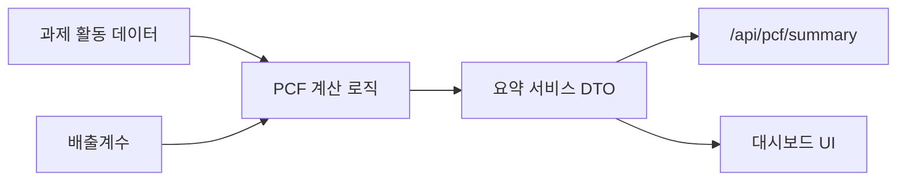

# 하나루프 탄소 대시보드

하나루프 프론트엔드 채용 과제를 위한 PCF(Product Carbon Footprint) 전과정 탄소 대시보드입니다.
과제 제공 활동 데이터를 기준으로 제품 `CT-045`의 총 배출량, 제품 단위 PCF, GHG Scope별 비중, 월별 추이를 한 화면에서 확인할 수 있습니다.

## 로컬 실행

1. 의존성을 설치합니다.

```bash
npm install
```

2. 개발 서버를 실행합니다.

```bash
npm run dev
```

3. 브라우저에서 `http://localhost:3000`을 엽니다.

## 검증 명령

```bash
npm run lint
npm run test
npm run build
```

현재 기준 세 명령 모두 통과합니다.

## 구현 범위

- 대상 제품: 컴퓨터 화면 `CT-045`
- 기술 스택: TypeScript, Next.js App Router, React, CSS
- 핵심 화면: KPI, 활동 유형별 배출량, GHG Scope별 배출량, 월별 배출량 추이, 상위 배출 활동
- 내부 API: `/api/pcf/summary`
- 테스트: PCF 계산 테스트, API 응답 테스트, 앱 진입점 smoke 테스트

## 주요 결과

| 항목 | 값 |
| --- | --- |
| 총 배출량 | `11,072.724 kgCO2e` |
| 총 배출량 환산 | `11.072724 tCO2e` |
| 제품 단위 PCF | `11,072.724 kgCO2e/데이터 묶음` |
| Scope 2 | `469.224 kgCO2e` |
| Scope 3 | `10,603.5 kgCO2e` |
| Scope 3 비중 | `95.8%` |

## 시스템 구조

```text
src/
  app/
    api/pcf/summary/route.ts      # 대시보드용 요약 API
    page.tsx                      # 첫 화면 진입점
  features/pcf/
    assignment-data.ts            # 과제 원본 활동 데이터와 배출계수
    calculations.ts               # PCF 계산과 집계 로직
    summary-service.ts            # UI/API 공용 응답 DTO
    PcfDashboard.tsx              # 대시보드 화면
```



## 설계 결정

- 활동 데이터와 배출계수를 분리했습니다. 실제 탄소 관리 플랫폼에서는 배출계수 버전과 적용일을 추적해야 하므로, 단순 계산 배열보다 확장성이 좋습니다.
- 전기는 구매 전력으로 보아 `Scope 2`, 원소재와 운송은 공급망 활동으로 보아 `Scope 3`에 매핑했습니다.
- 계산 로직과 화면 응답을 분리했습니다. `summary-service.ts`가 KPI, 기간, 데이터 출처를 붙여 UI와 API가 같은 구조를 사용합니다.
- 첫 화면은 랜딩 페이지가 아니라 실제 대시보드로 구성했습니다. 평가자가 실행 직후 핵심 수치와 월별 흐름을 바로 확인할 수 있게 하기 위한 결정입니다.

## Trade-off

- 과제 데이터에 실제 생산수량이 별도로 없어서 현재 `productionQuantity`는 과제 데이터 묶음 1개 기준입니다. 이후 입력 UX에서 생산수량을 조정해 단위 PCF를 재계산하도록 확장할 예정입니다.
- 현재 데이터 저장소는 DB가 아니라 TypeScript 정적 데이터입니다. 대신 타입, 계산 함수, 요약 서비스 경계를 분리해 PostgreSQL 또는 업로드 데이터로 옮기기 쉽게 만들었습니다.
- 월별 차트는 Recharts 대신 CSS 누적 막대로 구현했습니다. 초기 제출 단계에서는 서버 컴포넌트와 정적 빌드 안정성을 우선했고, 고급 상호작용이 필요해지면 Recharts로 교체할 수 있습니다.

## AI 활용

AI는 요구사항 정리, 누락 항목 점검, 테스트 케이스 후보 정리, PR 본문 초안 작성에 보조적으로 활용했습니다. 설계 판단과 최종 검토는 직접 수행했고, 특히 Scope 매핑, 배출계수 모델링, 계산 기대값, 화면 정보 우선순위는 수기 검토 로그로 남겼습니다.

자세한 기록은 아래 문서에서 관리합니다.

## 작업 현황

전체 작업과 진행률은 [docs/progress.md](docs/progress.md)에서 관리합니다.
작업 시간과 AI 활용 기록은 [docs/worktime-and-ai-log.md](docs/worktime-and-ai-log.md), 수기 검토 내역은 [docs/review-log.md](docs/review-log.md)에 정리했습니다.
